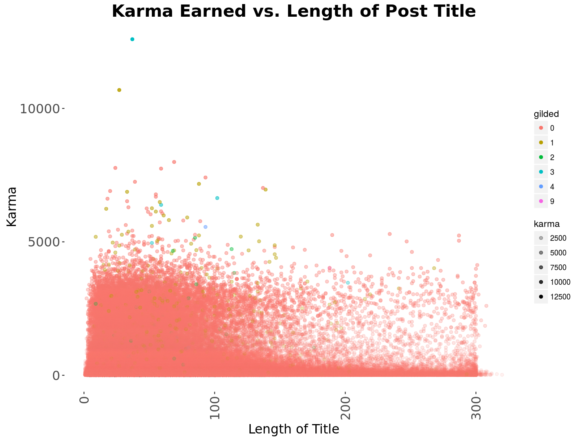
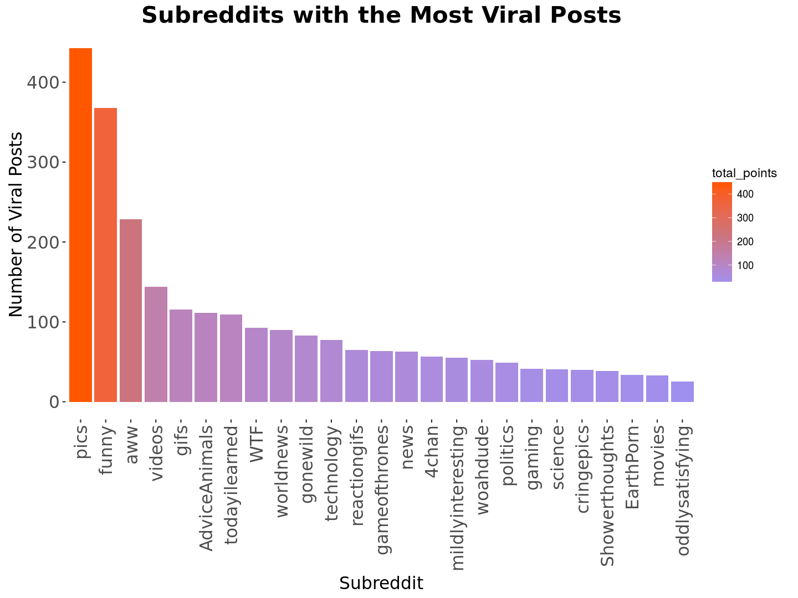
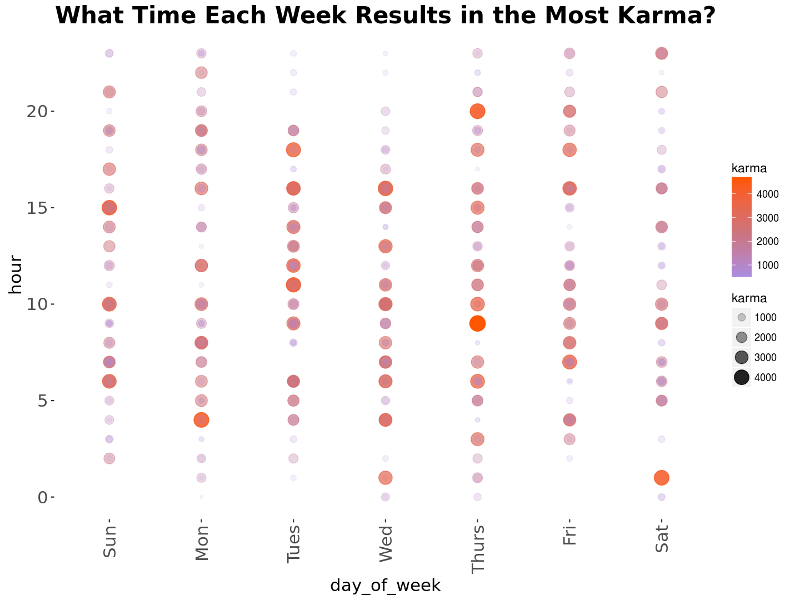

## Analysis of achieving success on Reddit *by SnooSquad* {#main-title}

- **Question:** How does Reddit Karma vary across various metrics?

- **DataSets:** Google BigQuery

Due to the extremely large size of the files, Google BigQuery, a SQL data querying cloud platform was used to quickly process large enough samples from our datasets

- **Key Variables of Interest:**

Time of post, post title, author, subreddit forum, karma (upvotes - downvotes), number of comments, and post/comment id's

- **Time Period:** December 2014

- **Methods:** 
    - In class: data wrangling (glyph-ready frames), data cleaning, ggplot, gandalf/batch commands, regex
    - Additional: igraph (network visualization), network, adjacency lists, BigQuery (Google cloud), SQL, bigrquery

## Network graph of interactions on Reddit {#network}

## Summary of results {#results}

 
 

